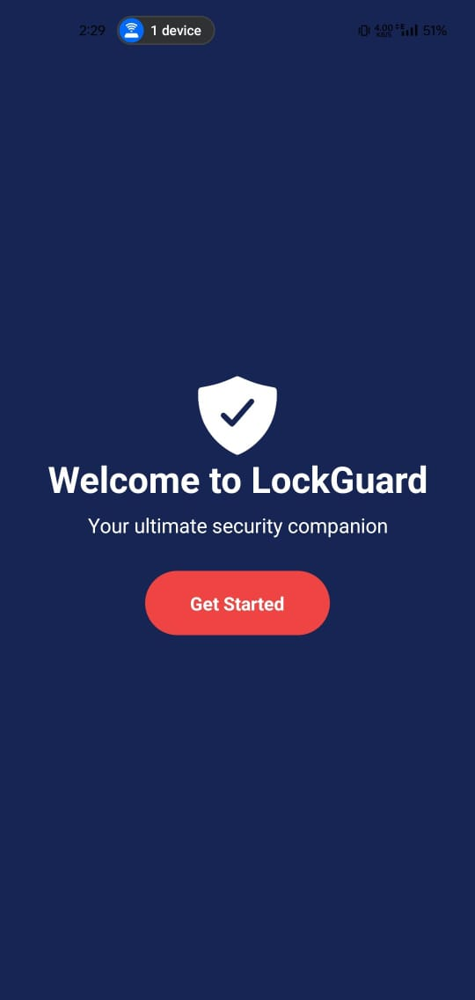
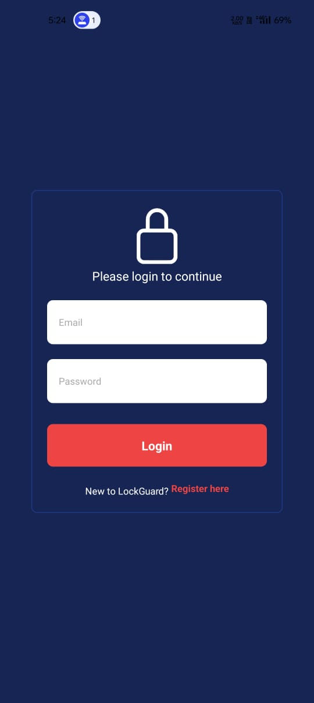
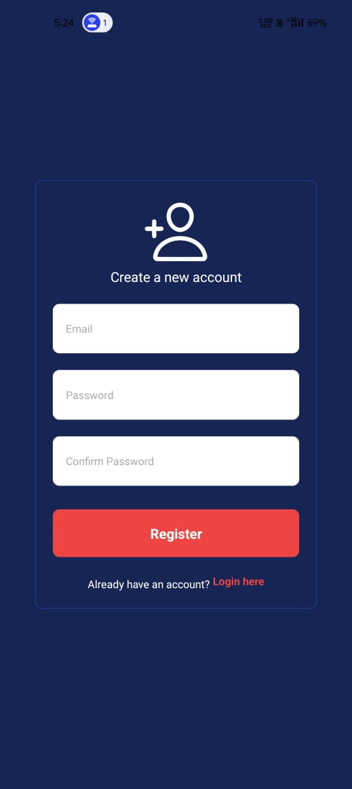
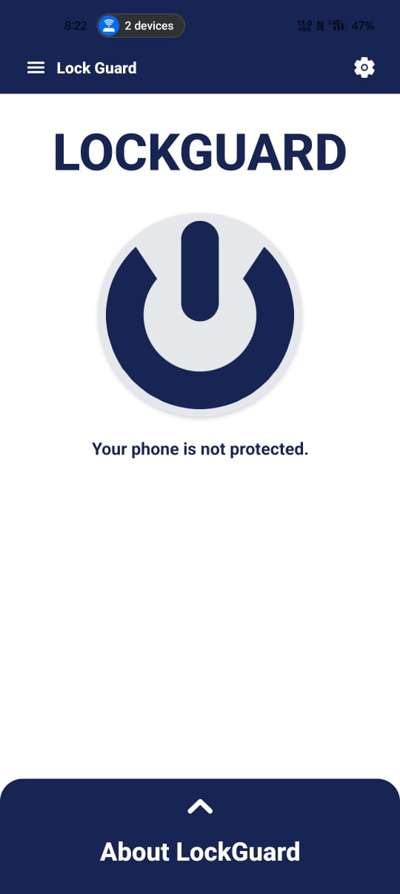
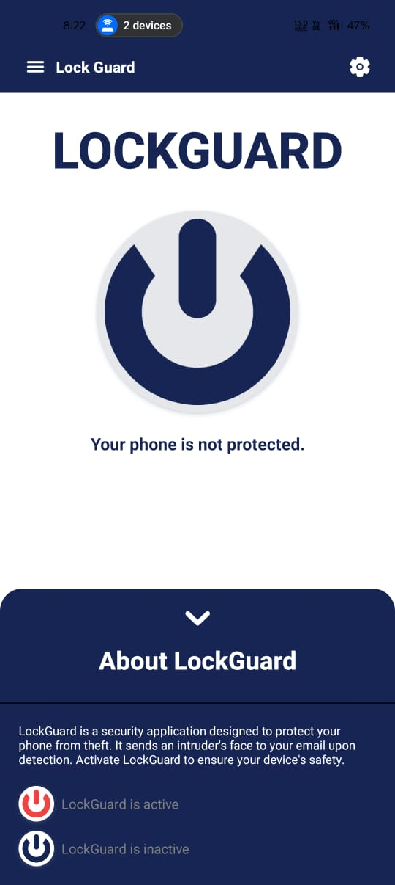

<center>
   
</center>

---

# LockGuard

LockGuard is a mobile application designed to enhance the security of your device by protecting against theft and sending intruder images to your email.

## Features

- **Anti-Theft Protection**: Secure your phone from unauthorized access. LockGuard provides robust security features to keep your device safe.
- **Intruder Image Capture**: Automatically captures photos of unauthorized users and sends them to your designated email, ensuring you are alerted in case of any intrusion.
- **User-Friendly Interface**: Intuitive design for seamless navigation. The app is designed with simplicity and ease of use in mind, making it accessible for all users.
- **Biometric Authentication**: Supports biometric authentication for additional security, allowing users to unlock their devices using fingerprint or facial recognition.
- **Real-Time Notifications**: Get instant alerts if an intruder tries to access your device.

## Learnings

<ul>
   <li>How to implement TypeScript in React Native</li>
   <li>Routing between files using React Navigation and Expo Router</li>
   <li>Managing state and context in a React Native application</li>
   <li>Using native modules and integrating with device APIs</li>
   <li>Handling asynchronous operations and background tasks in React Native</li>
</ul>

---

<details>
   <summary><h1>Pending</h1></summary>
   <ul>
      <li>Make a server to authenticate and send the details to users via server using JWT</li>
      <b>Note:</b> It's on hold until a solution for monitoring the lock screen is found.
   </ul>
</details>

---

<details>
   <summary> <h1>Problems</h1></summary>
   <ul>
      <li>There is currently no way in React Native to monitor the phone's lock screen and send the photo due to platform limitations.</li>
      <li>Even with user permission, it is not possible due to the operating system's security design. This is a fundamental restriction to ensure user privacy and security.</li>
   </ul>
</details>

---

## Getting Started

To get started with LockGuard, follow these steps:

1. **Clone the repository:**

   ```bash
   git clone https://github.com/your-username/lockguard.git
   cd lockguard
   ```

2. **Install dependencies:**

   ```bash
   npm install
   ```

3. **Run the application:**

   ```bash
   expo start
   ```

   Scan the QR code with the Expo Go app on your smartphone or run the app on an emulator.

## Contributing

Contributions are welcome! If you have any ideas or improvements, please open an issue or submit a pull request. Here's how you can contribute:

1. Fork the repository
2. Create your feature branch (`git checkout -b feature/YourFeature`)
3. Commit your changes (`git commit -m 'Add some YourFeature'`)
4. Push to the branch (`git push origin feature/YourFeature`)
5. Open a pull request

## Acknowledgments

- Special thanks to the contributors and community for their support and feedback.
- [React Native](https://reactnative.dev/) - The framework used for building the mobile application.
- [Expo](https://expo.dev/) - The platform used for developing, building, and deploying the app.

---

Thank you for using LockGuard. We hope it provides the security and peace of mind you need for your device.

## Screenshots


<div style="display: flex; justify-content: space-between; flex-wrap: wrap;">
   
   
</div>
<div style="display: flex; justify-content: space-between; flex-wrap: wrap; margin-top: 10px;">
   
   
</div>
